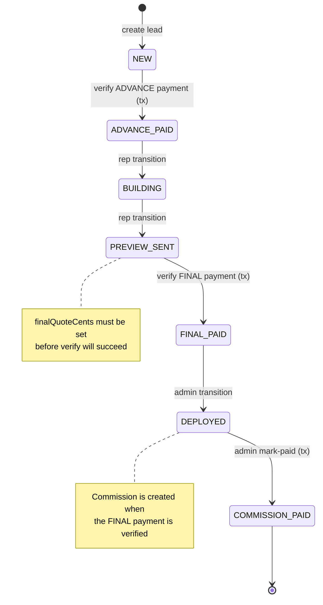
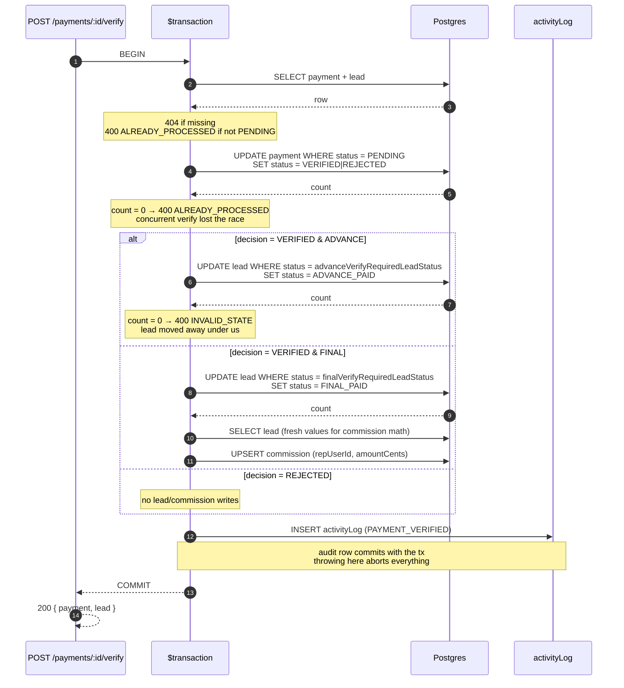

# Portal Lead FSM & Payment-Verify Transaction

This doc complements the code review fixes by capturing the two pieces of behaviour that are easy
to mis-implement: the lead state machine (now driven by `portalSettings.manualTransitions`) and
the verify-payment transaction (the read-then-write race that was fixed in C1).

## Lead state machine

Manual transitions (driven by settings) are shown in solid lines; payment-driven transitions are
dashed and happen inside the verify transaction. `COMMISSION_PAID` is terminal — every other state
is mutable subject to FSM rules.

### Guards (encoded in `services/leadGuards.ts` + `services/leadFsm.ts`)

| Guard | Where | Behaviour |
|---|---|---|
| `assertLeadMutable` | every PATCH/transition/mark-payment | rejects any mutation while `lead.status ∈ terminalNoMutationStatuses` (default `[COMMISSION_PAID]`) |
| `assertManualTransition` | `POST /leads/:id/transition` | rejects unless the requested `from→to` edge exists in `manualTransitions`, is `enabled`, and the caller satisfies `adminOnly` |
| `assertLeadAccess` | every read/mutate of a single lead | RBAC: admins see everything, reps see only their `createdByUserId` or `assignedToUserId` leads |
| Payment kind gate | `POST /leads/:id/payments` | rejects unless `lead.status === advancePaymentRequiredLeadStatus` (or final) |

## Payment-verify transaction (C1)

Before the fix, verify did:

1. read payment + lead
2. update payment status to VERIFIED
3. if lead.status matches → update lead status (separate write)

Two admins clicking Verify at the same time both saw step 1 as VERIFIED+matching, and both
proceeded to step 3 — leaving the lead in a deterministic-but-wrong state on the loser. The new
transaction wraps everything and uses conditional `updateMany` for the lead flip, so the database
serialises the contention:

### Why the conditional `updateMany`

`UPDATE lead WHERE id = ? AND status = ?` is a single atomic statement. If a concurrent transaction
flips the lead's status between our read and our intended write, our update matches zero rows and
we surface a `409 CONCURRENT_MODIFICATION` (lead transition handler) or `400 INVALID_STATE`
(verify handler). The previous code did `findUnique → check → update` outside the tx, which has a
read-write window that bigger workloads will eventually trip.

### Other paths covered by the same pattern

| Endpoint | Conditional write |
|---|---|
| `POST /payments/:id/verify` | `payment.updateMany WHERE status = PENDING`, `lead.updateMany WHERE status = required` |
| `POST /leads/:id/transition` | `lead.updateMany WHERE status = previouslyRead` |
| `POST /commissions/:id/mark-paid` | `commission.updateMany WHERE isPaid = false`, `lead.updateMany WHERE status = DEPLOYED` |
| `PATCH /leads/:id` | wrapped in `$transaction`; commission row updates happen on the same tx client |

## Audit log durability (C4)

`logActivity` now accepts an optional `tx` parameter and uses it when provided. Money-affecting
endpoints pass `tx` so the activity row commits or rolls back with the action. Non-critical
actions (LOGIN, LOGOUT, EXPORT) still log on the top-level client and swallow errors at `warn`
level, because we'd rather drop one telemetry row than fail a user's login over a transient DB
issue.
